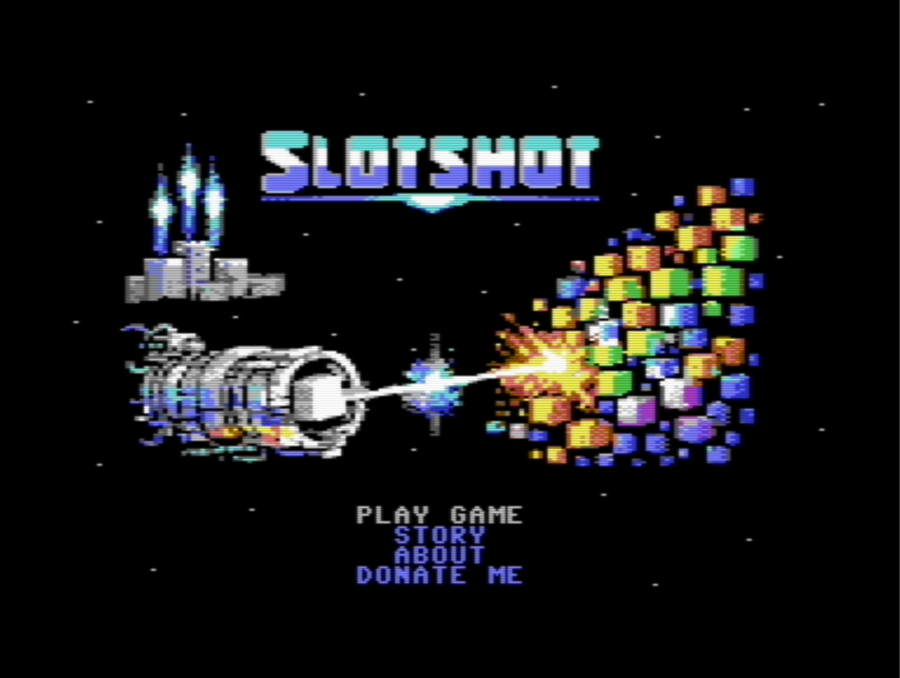
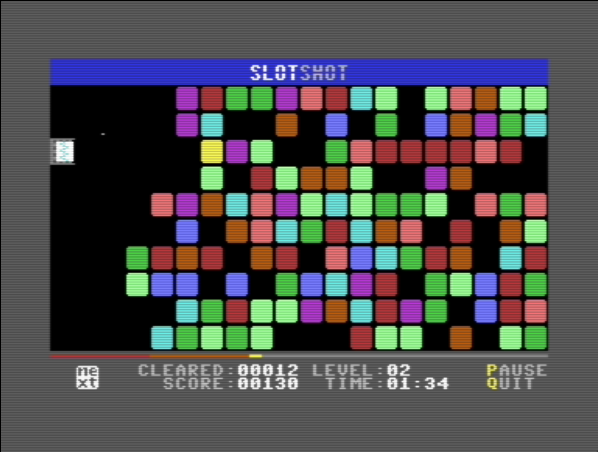

# Slotshot

<p align="center">
  <i>A fast-paced puzzle shooter for the Commodore 64</i>
</p>

<p align="center">
  
  
</p>

## About

**Slotshot** is a unique blend of puzzle and shooter mechanics designed for the Commodore 64. Set on Deep Space Colony K-7 in the year 2084, you must stop a mysterious crystalline growth from consuming the station by shooting colored vaccine blocks through gaps to neutralize entire columns.

The game combines fast reflexes with strategic thinking as you manage three different bullet types, cascading blocks, and an accelerating threat level.

## Game Features

### Core Mechanics

- **Fill the Gaps**: Shoot colored blocks to fill empty spaces in columns
- **Complete Columns Vanish**: Fill all 10 rows in a column to clear it
- **Cascade Physics**: When a column clears, blocks slide right to fill the space
- **Block Aging**: Hit blocks fade from white → grey → dark grey → black (gone)
- **Progressive Difficulty**: 10 levels with increasing speed

### Three Bullet Types

Each bullet type has unique behavior:

| Type | Color | Behavior |
|------|-------|----------|
| **White** | ⚪ | Standard - stops at first wall |
| **Yellow** | 🟡 | Drills through walls - stops at first gap |
| **Blue** | 🔵 | Permanent - blocks don't age after hit |

The next bullet type is randomly selected and shown in the "Next" indicator.

### Scoring System

- **Column Clear**: 10 points + (5 × level)
- **Cascade Clear**: 15 points + (5 × level)
- **Shot Cost**: -1 point per shot
- **High Score**: Saved between sessions

### Technical Highlights

- **IRQ-Driven Animation**: Smooth 60 FPS sprite movement for cannon and bullets
- **Raster Split Graphics**: Bitmap title screen with text menu overlay
- **RLE Compression**: Efficient storage of title screen artwork
- **Furnace Tracker Music**: Three original music tracks
- **Zero Page Optimization**: Fast gameplay with minimal overhead
- **Memory Relocation**: Critical code relocated to specific addresses for better memory utilization

## Controls

| Input | Action |
|-------|--------|
| **Arrow Keys** / **W/S** / **Joystick 2** | Move cannon up/down |
| **SPACE** / **Fire Button** | Shoot |
| **P** | Pause/Resume |
| **Q** | Quit to menu |

## System Requirements

- **Platform**: Commodore 64 (PAL or NTSC)
- **Memory**: 64 KB RAM
- **Storage**: Floppy disk or SD card (Vice emulator supported)
- **Optional**: Joystick in Port 2

## Building from Source

> **Note**: Slotshot is written in **PyCo**, a Python-inspired programming language for retro systems. The PyCo compiler is currently in private development and will be released under the **Apache 2.0 license** in around **Q3 2026** (maybe sooner).

### Running

**On VICE Emulator:**
```bash
# Auto-start the disk image
x64sc slotshot.d64
```

**On Real Hardware:**
- Transfer `slotshot.d64` to a 1541 floppy disk or SD2IEC
- Load and run: `LOAD "SLOTSHOT",8,1` then `RUN`

## Project Structure

```
slotshot/
├── slotshot.pyco              # Main game code (3,385 lines)
├── slotshot.toml              # Build configuration
├── includes/                  # Game assets
│   ├── slotshot_image_rle.pyco           # Title screen (RLE compressed)
│   ├── slotshot_music.pyco               # Main menu music
│   ├── slotshot_gameover_music.pyco      # Game over music
│   └── slotshot_highscore_music.pyco     # High score music
├── work/                      # Source assets
│   ├── music/                 # Furnace Tracker files (.fur)
│   ├── sprites/               # Sprite editor files (.spm)
│   └── title_image/           # Koala Painter file (.koa)
└── build/                     # Generated files (not in repo)
    ├── slotshot.asm           # Generated assembly
    ├── slotshot.prg           # Compiled program
    └── slotshot.d64           # Disk image
```

## Technical Details

### Memory Map

| Region | Address | Size | Purpose |
|--------|---------|------|---------|
| Sprite Data | $C000-$C13F | 320 bytes | 5 sprites (cannon, bullet, sparkle, star) |
| Relocated Code | $C140-$C3FF | ~610 bytes | SFX + IRQ handlers |
| Screen RAM | $C400-$C7FF | 1 KB | Game screen + sprite pointers |
| Charset | $C800-$CFFF | 2 KB | ROM copy + custom chars |
| Title Bitmap | $E000-$FFFF | 8 KB | Title screen bitmap |

## Credits

**Created by**: Adam Wallner
**Written in**: PyCo Language (coming Q3 2026 under Apache 2.0)
**Music**: Original compositions in Furnace Tracker
**Graphics**: Custom C64 multicolor bitmap art

## License

Copyright © 2025-2026 Adam Wallner

This program is free software: you can redistribute it and/or modify it under the terms of the **GNU General Public License v3.0** as published by the Free Software Foundation.

This program is distributed in the hope that it will be useful, but WITHOUT ANY WARRANTY; without even the implied warranty of MERCHANTABILITY or FITNESS FOR A PARTICULAR PURPOSE. See the GNU General Public License for more details.

You should have received a copy of the GNU General Public License along with this program. If not, see <https://www.gnu.org/licenses/>.

## Support the Project

If you enjoy Slotshot, consider supporting development:
https://bit.ly/slotshot

## Links

- **PyCo Language**: Coming Q3 2026 (Apache 2.0)
- **Issue Tracker**: https://github.com/PyCoLang/slotshot/issues
- **Releases**: https://github.com/PyCoLang/slotshot/releases

---

*Made with ❤️ for the Commodore 64 community*
